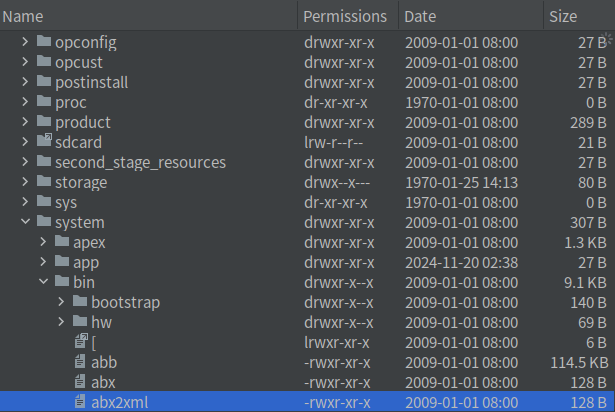

## 一、背景：
Android12高版本以后系统路径下很多的xml都变成了二进制类型，无法直接查看xml的内容具体。
使用BinaryXmlSerializer最重要原因是：  
1、可以有更快的速度  
2、更小的体积

## 二、如何把二进制变成正常可读xml
### 2.1 修改属性S
改变属性，删除原来的xml重启，重新生成xml
```shell
adb shell setprop persist.sys.binary_xml false
```
###  2.2 使用Android系统自带的xml加解密工具，位于 /system/bin下的abx2xml和xml2abx  

  

例如/data/system/packages.xml文件直接打开是如下图的乱码状态，需要使用命令转换一下
  
命令格式为：
```shell
abx2xml [-i] input文件路径 [output文件路径]
xml2abx [-i] input文件路径 [output文件路径]
```
```shell
adb shell abx2xml /data/system/packages.xml /data/system/packages-read.xml
```
转换后的packages-read.xml文件内容如下：  
  

## 三、abx2xml和xml2abx命令解析
abx2xml和xml2abx其实代码都是一样的，本质就是个sh脚本而已，都是调用到了Abx这个java类 

```shell
#/system/bin/abx2xml
#!/system/bin/sh  
export CLASSPATH=/system/framework/abx.jar  
exec app_process /system/bin com.android.commands.abx.Abx "$0" "$@"

#/system/bin/xml2abx  
#!/system/bin/sh  
export CLASSPATH=/system/framework/abx.jar  
exec app_process /system/bin com.android.commands.abx.Abx "$0" "$@"  
```

## 四、源码剖析Abx类
```java
package com.android.commands.abx;

/**
 * Utility that offers to convert between human-readable XML and a custom binary
 * XML protocol.
 *
 * @see Xml#newSerializer()
 * @see Xml#newBinarySerializer()
 */
public class Abx {
    private static final String USAGE = "" +
            "usage: abx2xml [-i] input [output]\n" +
            "usage: xml2abx [-i] input [output]\n\n" +
            "Converts between human-readable XML and Android Binary XML.\n\n" +
            "When invoked with the '-i' argument, the output of a successful conversion\n" +
            "will overwrite the original input file. Input can be '-' to use stdin, and\n" +
            "output can be '-' to use stdout.\n";

    private static InputStream openInput(String arg) throws IOException {
        if ("-".equals(arg)) {
            return System.in;
        } else {
            return new FileInputStream(arg);
        }
    }

    private static OutputStream openOutput(String arg) throws IOException {
        if ("-".equals(arg)) {
            return System.out;
        } else {
            return new FileOutputStream(arg);
        }
    }

    private static void mainInternal(String[] args) {
        if (args.length < 2) {
            throw new IllegalArgumentException("Missing arguments");
        }

        final XmlPullParser in;
        final XmlSerializer out;
        if (args[0].endsWith("abx2xml")) {//这里根据传递近来参数看看是否要二进制xml转普通还是逆过来转
            in = Xml.newBinaryPullParser();//二进制转普通，那么输入就是BinaryPullParser，输出就是普通的
            out = Xml.newSerializer();
        } else if (args[0].endsWith("xml2abx")) {
            in = Xml.newPullParser();//普通转二进制，那么输入就是普通的，输出就是newBinarySerializer
            out = Xml.newBinarySerializer();
        } else {
            throw new IllegalArgumentException("Unsupported conversion");
        }

        final boolean inPlace = "-i".equals(args[1]);
        final String inputArg = inPlace ? args[2] : args[1];
        final String outputArg = inPlace ? args[2] + ".tmp" : args[2];

        try (InputStream is = openInput(inputArg);
                OutputStream os = openOutput(outputArg)) {
            in.setInput(is, StandardCharsets.UTF_8.name());//输入设置对应的流InputStream
            out.setOutput(os, StandardCharsets.UTF_8.name());//输出设置对应的流OutputStream
            out.setFeature("http://xmlpull.org/v1/doc/features.html#indent-output", true);
            Xml.copy(in, out);//再调用 Xml.copy，重点
            out.flush();
        } catch (Exception e) {
            // Clean up failed output before throwing
            if (inPlace) {
                new File(outputArg).delete();
            }
            throw new IllegalStateException(e);
        }

        // Successful in-place conversion of a file requires a rename
        if (inPlace) {
            if (!new File(outputArg).renameTo(new File(inputArg))) {
                throw new IllegalStateException("Failed rename");
            }
        }
    }

    public static void main(String[] args) {
        try {
            mainInternal(args);
            System.exit(0);
        } catch (Exception e) {
            System.err.println(e.toString());
            System.err.println();
            System.err.println(USAGE);
            System.exit(1);
        }
    }
}
```
整体算比较简单，核心方法就剩下一个Xml.copy方法
XML的相关copy方法如下：
```java
    /**
     * Copy the first XML document into the second document.
     * <p>
     * Implemented by reading all events from the given {@link XmlPullParser}
     * and writing them directly to the given {@link XmlSerializer}. This can be
     * useful for transparently converting between underlying wire protocols.
     *
     * @hide
     */
    public static void copy(@NonNull XmlPullParser in, @NonNull XmlSerializer out)
            throws XmlPullParserException, IOException {
        // Some parsers may have already consumed the event that starts the
        // document, so we manually emit that event here for consistency
        if (in.getEventType() == XmlPullParser.START_DOCUMENT) {
            out.startDocument(in.getInputEncoding(), true);
        }

        while (true) {
            final int token = in.nextToken();//不断循环xml的内容节点等，也就是说in读出什么就往out中写什么
            switch (token) {
                case XmlPullParser.START_DOCUMENT:
                    out.startDocument(in.getInputEncoding(), true);
                    break;
                case XmlPullParser.END_DOCUMENT:
                    out.endDocument();
                    return;
                case XmlPullParser.START_TAG:
                    out.startTag(normalizeNamespace(in.getNamespace()), in.getName());
                    for (int i = 0; i < in.getAttributeCount(); i++) {
                        out.attribute(normalizeNamespace(in.getAttributeNamespace(i)),
                                in.getAttributeName(i), in.getAttributeValue(i));
                    }
                    break;
                case XmlPullParser.END_TAG:
                    out.endTag(normalizeNamespace(in.getNamespace()), in.getName());
                    break;
                case XmlPullParser.TEXT:
                    out.text(in.getText());
                    break;
                case XmlPullParser.CDSECT:
                    out.cdsect(in.getText());
                    break;
                case XmlPullParser.ENTITY_REF:
                    out.entityRef(in.getName());
                    break;
                case XmlPullParser.IGNORABLE_WHITESPACE:
                    out.ignorableWhitespace(in.getText());
                    break;
                case XmlPullParser.PROCESSING_INSTRUCTION:
                    out.processingInstruction(in.getText());
                    break;
                case XmlPullParser.COMMENT:
                    out.comment(in.getText());
                    break;
                case XmlPullParser.DOCDECL:
                    out.docdecl(in.getText());
                    break;
                default:
                    throw new IllegalStateException("Unknown token " + token);
            }
        }
    }
```